# Configuring an AD Group for Kerberos authentication and LDAP authorization with MarkLogic Server

This guide follows on from - and relies on - most of the configuration and setup as found in the guide for [configuring a Single User for Kerberos authentication with MarkLogic Server](SETUP.md).  The additional steps outlined in this guide demonstrate the creation of an Active Directory group and then configuring the necessary mappings for MarkLogic Server.

If you're in any doubt, please review the steps in the previous guide first.

## Create a Group for LDAP Authorization

Any users added to this group will be mapped to a corresponding MarkLogic group

- Right click on the Start menu and select Run and then type in **dsa.msc** to open **Active Directory Users and Computers**
           - New Group
- Give it a name (we will call this **MarkLogic**)


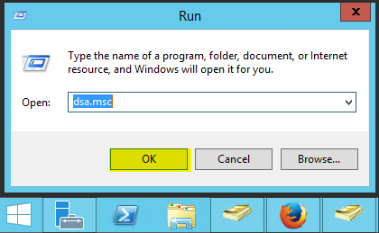

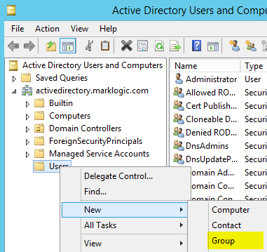

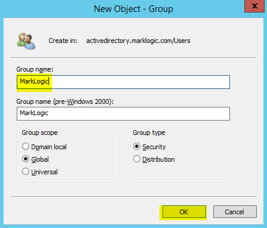

## Add user(s) to your new group

- Right click on your user (in this example we will be using **testuser** created in the previous guide).

- Use xdmp:ldap-lookup()
  - Note that the lookup path should be the same as the output from `setspn -L testuser` (see SETUP.md for details)
  - Check that ML can read the memberOf attribute using a simple xdmp:ldap-lookup, make a note of the memberOf DN as this is what is used in the role mapping
```xquery
xquery version "1.0-ml";
xdmp:ldap-lookup('CN=testuser,CN=Users,DC=activedirectory,DC=marklogic,DC=com',
  <options xmlns="xdmp:ldap">
      <username>Test User</username>
      <password>testuser-password</password>
      <server-uri>ldap://your-active-directory-hostname:389</server-uri>
      <bind-method>simple</bind-method>
 </options>
)
```

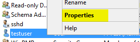

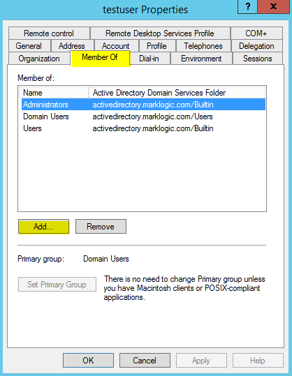

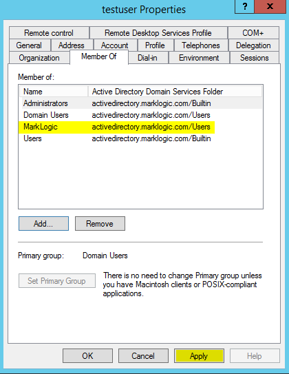

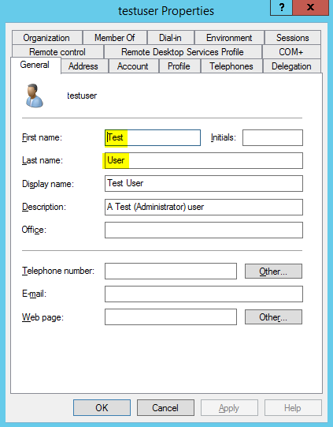

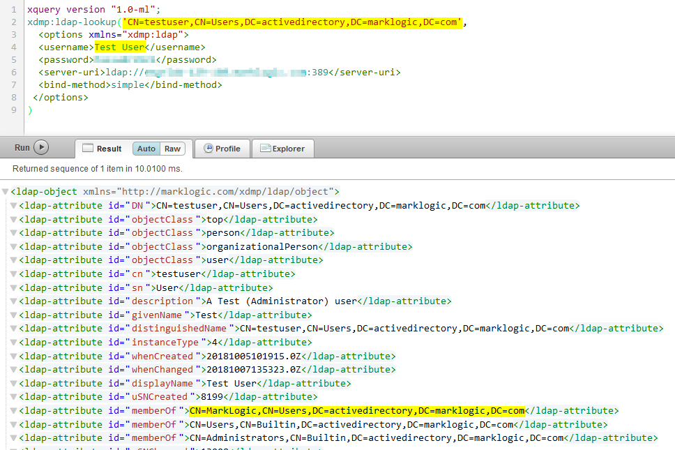

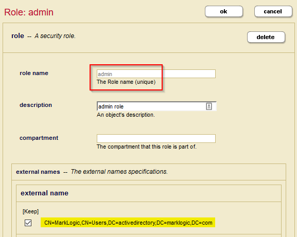

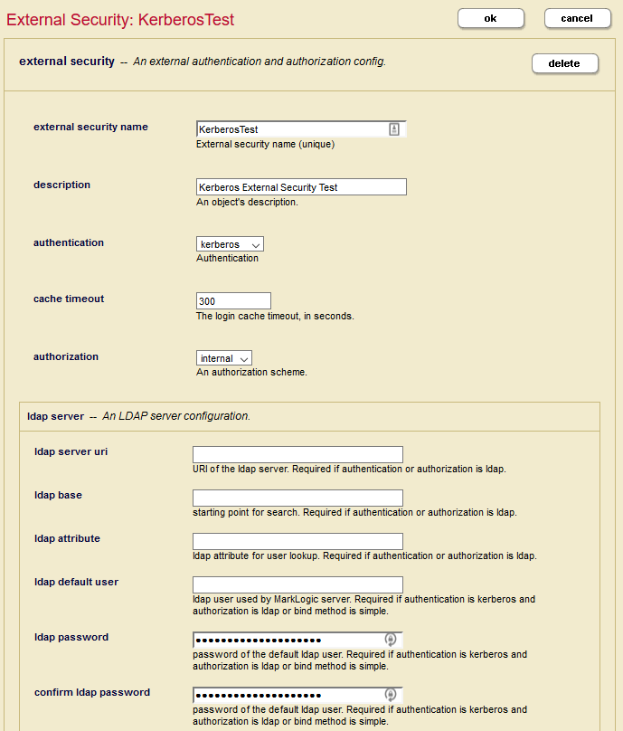

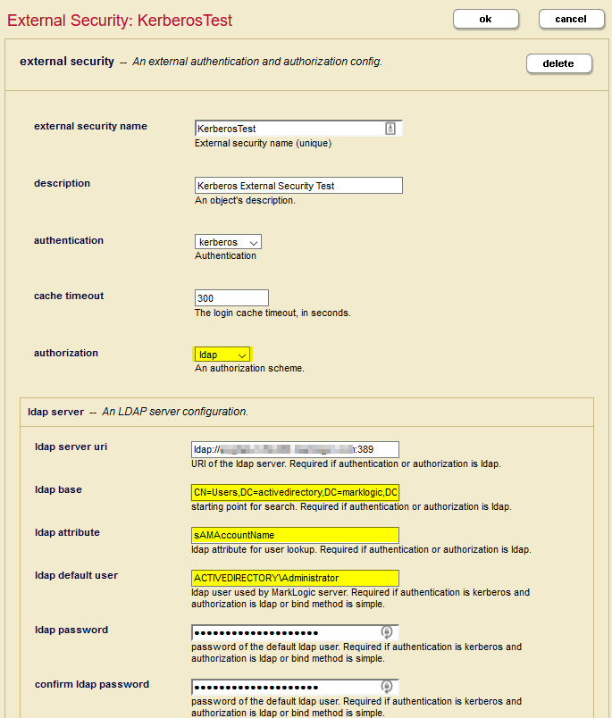

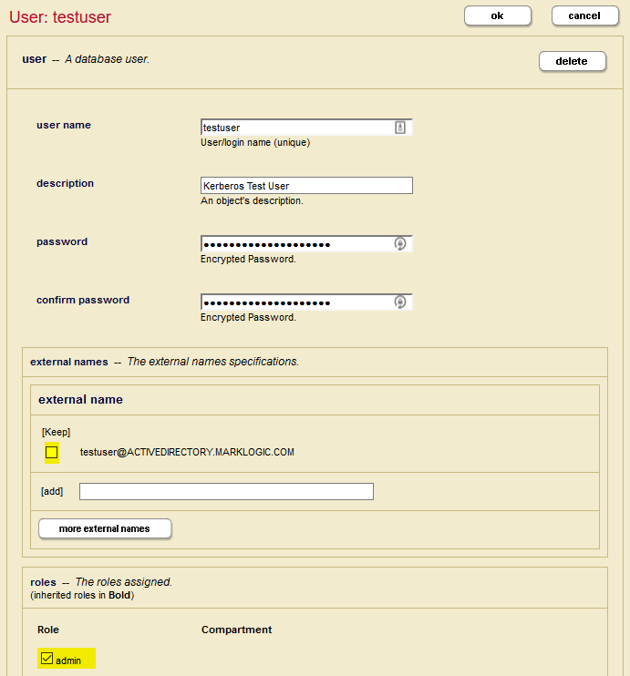


### Test

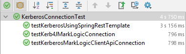


### AccessLogs Before

When the tests ran with the single user mapping configured, you would have seen something like this when the tests were run:
```
172.31.250.159 - - [08/Oct/2018:09:34:25 -0700] "GET / HTTP/1.1" 401 104 - "Apache-HttpClient/4.3.3 (java 1.5)"
External User(testuser) is Mapped to User(testuser)
172.31.250.159 - testuser [08/Oct/2018:09:34:27 -0700] "GET / HTTP/1.1" 200 2103 - "Apache-HttpClient/4.3.3 (java 1.5)"
External User(testuser) is Mapped to User(testuser)
172.31.250.159 - testuser [08/Oct/2018:09:34:28 -0700] "GET / HTTP/1.1" 200 2103 - "Java/1.8.0_172"
External User(testuser) is Mapped to User(testuser)
172.31.250.159 - testuser [08/Oct/2018:09:34:29 -0700] "POST /v1/eval HTTP/1.1" 200 137 - "okhttp/3.10.0"
```

### AccessLogs After

With the new mappings in place, you should see messages like this:

```
172.31.250.158 - - [10/Oct/2018:04:08:38 -0700] "GET / HTTP/1.1" 401 104 - "Apache-HttpClient/4.3.3 (java 1.5)"
External User(testuser@ACTIVEDIRECTORY.MARKLOGIC.COM) is Mapped to Temp User(testuser@ACTIVEDIRECTORY.MARKLOGIC.COM) with Role(s): admin
172.31.250.158 - testuser@ACTIVEDIRECTORY.MARKLOGIC.COM [10/Oct/2018:04:08:40 -0700] "GET / HTTP/1.1" 200 2103 - "Apache-HttpClient/4.3.3 (java 1.5)"
External User(testuser@ACTIVEDIRECTORY.MARKLOGIC.COM) is Mapped to Temp User(testuser@ACTIVEDIRECTORY.MARKLOGIC.COM) with Role(s): admin
172.31.250.158 - testuser@ACTIVEDIRECTORY.MARKLOGIC.COM [10/Oct/2018:04:08:41 -0700] "GET / HTTP/1.1" 200 2103 - "Java/1.8.0_172"
External User(testuser@ACTIVEDIRECTORY.MARKLOGIC.COM) is Mapped to Temp User(testuser@ACTIVEDIRECTORY.MARKLOGIC.COM) with Role(s): admin
172.31.250.158 - testuser@ACTIVEDIRECTORY.MARKLOGIC.COM [10/Oct/2018:04:08:41 -0700] "POST /v1/eval HTTP/1.1" 200 137 - "okhttp/3.10.0"
```


## Troubleshooting

Trace event: LDAP Search Detail