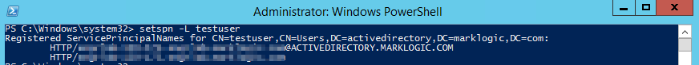

# Configuring a Single User for Kerberos authentication with MarkLogic Server

## Prerequisites
- A Windows Server (this guide uses Windows Server 2012 R2) which you can RDC into and have Administrator rights.
- A separate instance running MarkLogic 9 (this guide uses Redhat Enterprise Linux 7 as the Operating System)

## Create a single test user (with Administrator access)

- Create a Remote Desktop Connection into your Windows Machine and log in.


- Create a new local user on the server (you'll use this to log back into the machine after Active Directory has been set up)
  - Right click on Start and Select **Computer Management** from the context menu
  - In **Computer Management** expand **Local Users and Groups**, select the **Users** folder icon, right click in the main panel and select **New User...** from the context menu
  - Set the User name field and create a password; uncheck **User must change password at next logon** and click on **Create**
  - Your test user should now be listed as a new user; right click on the user and select **Properties**
  - Select the **MemberOf** tab and select **Add**
  - In the **Select Groups** dialogue box type in *Administrators* and click on **Check Names** then **OK**
  - Confirm user is now listed as being a member of the Administrators group and ensure Apply is set to save the changes
  - Test the login to ensure you're able to get back in after


## Setting up Active Directory on your Windows Server

- Open the **Server Manager** using the icon in the task bar.
- From the **Server Manager** dashboard, select **Add roles and features** (item 2) from the options
- On the Installation Type screen, select Role-based or features-based and click Next.
- By default, the current server is selected. Click Next.
- On the Server Roles screen, select the check box next to Active Directory Domain Services.


From the task bar, click Open the Server Manager.

Select the yellow notifications icon in the top navigation bar of the Server Manager window.

The Notifications Pane opens and displays a Post-deployment Configuration notification. Click the Promote this server to a domain controller link that appears in the notification.


From the Deployment Configuration tab, select Radial options > Add a new forest. Enter your root domain name in the Root domain name field and click Next.

Select a Domain and a Forest functional level.

Enter a password for Directory Services Restore Mode (DSRM) in the Password field.

Note: The DSRM password is used when booting the Domain Controller into recovery mode.

Review the warning on the DNS Options tab and select Next.

Confirm or enter a NetBIOS name and click Next.

Specify the locations of the Database, Log files, and SYSVOL folders, then click Next.

Review the configuration options and click Next.

The system checks if all of the necessary prerequisites are installed on the system. If the system passes these checks, click Install.

Note: The server automatically reboots after the installation is complete.

After the server reboots, reconnect to it by using Microsoft Remote Desktop Protocol (RDP).


## Log back in after reboot


## Configure your test user

- Right click on the Start menu and select Run and then type in **dsa.msc** to open **Active Directory Users and Computers**
- Expand the Active Directory domain (in this example, it's called **activedirectory.marklogic.com**) and select **Users**
- Find your *testuser* User, right-click and select **Properties**
- Select the **Account** tab and enter the following information under the **User login name** heading:
  - The first input field will contain the **Subject Principal Name** (**SPN**) used to connnect to MarkLogic Server.  The syntax for this will be **HTTP/** (*note the single forward slash*) followed by the Fully Qualified Domain Name (FQDN) of the **MarkLogic host** (this is listed at the top of the page in the Admin GUI on port 8001 in MarkLogic Server or can be determined by typing in hostname in a shell session to the OS running MarkLogic Server). For example **HTTP/marklogic.example.com**
  - The second input field is a dropdown, use it to select your Active Directory domain (in this example it is **@activedirectory.marklogic.com**)
  - Together these will create a union connecting the MarkLogic host with the Active Directory domain name (for example: *HTTP/marklogic.example.com@activedirectory.marklogic.com*)
  - Save these settings using the **Apply** button


Your test user should now be set up correctly.

## Set up the Service Principal name and create the services.keytab

[This part is also covered in the MarkLogic Documentation](https://docs.marklogic.com/guide/security/external-auth#id_17860)

We are ready to create the services.keytab which will be copied over to the data directory of the MarkLogic host.  Some points to note:

- The keytab is generated on your Windows host and from there can be copied over to your MarkLogic instance
- The user being mapped here is the user that was created in the earlier steps (e.g. **testuser**)
- The Active Directory domain should be specified using upper case characters (e.g. **@ACTIVEDIRECTORY.MARKLOGIC.COM**)
- You should use an Administrator connection to Powershell to execute these commands; right click on the Powershell icon in the task bar (**>_**) and select **Run as Administrator** and then select **Yes** at the **User Account Control** prompt

- Set the Service Principal Name (SPN) using the `setspn` command
- The syntax is `setspn -A` [SPN URI] *name_of_user*
- The URI will be HTTP/marklogic_hostname@YOUR_ACTIVEDIRECTORY_DOMAIN

```
setspn -A HTTP/marklogic_hostname@YOUR_ACTIVEDIRECTORY_DOMAIN testuser
```

To test it you can use a call to `setspn -L [username]` - if everything worked as expected, you should see something like the following:

```
PS C:\Windows\system32> setspn -L testuser
Registered ServicePrincipalNames for CN=testuser,CN=Users,DC=activedirectory,DC=marklogic,DC=com:
        HTTP/marklogic_hostname@ACTIVEDIRECTORY.MARKLOGIC.COM
        HTTP/marklogic_hostname
PS C:\Windows\system32>
```

- When you're ready, use the **ktpass** command at the prompt to create the **services.keytab** file (make sure you're not in the **C:\Windows\system32** directory before you do this):

```
ktpass /princ HTTP/marklogic_hostname@YOUR_ACTIVEDIRECTORY_DOMAIN /mapuser testuser@YOUR_ACTIVEDIRECTORY_DOMAIN /pass userpassword /out services.keytab
``` 

You should see something like this:

```
PS C:\> ktpass /princ HTTP/marklogic_hostname@ACTIVEDIRECTORY.MARKLOGIC.COM /mapuser testuser@ACTIVEDIRECTORY.MARKLOGIC.COM /pass YOURUSERPASSWORD /out services.keytab
Targeting domain controller: windows_ad_host.activedirectory.marklogic.com
Using legacy password setting method
Successfully mapped HTTP/marklogic_hostname to testuser.
WARNING: pType and account type do not match. This might cause problems.
Key created.
Output keytab to services.keytab:
Keytab version: 0x502
keysize 107 HTTP/marklogic_hostname@ACTIVEDIRECTORY.MARKLOGIC.COM ptype 0 (KRB5_NT_UNKNOWN) vno 3 etype 0x17 (RC4-HMAC) keylength 16 (0x077cccc23f8ab7031726a3b70c694a49)
```

And you can confirm that the file **services.keytab** has been created by issuing the **ls** command at the prompt.





## Copy services.keytab over to the host running MarkLogic Server

First, copy the services.keytab over to the MarkLogic instance.  In this example, we're using **Cygwin** and **scp** to copy the file to the /tmp directory on the MarkLogic host:

```
$ scp /cygdrive/c/services.keytab unixusername@marklogic_hostname:/tmp
```


## Install the keytab on MarkLogic Server

In order to do this, we need to:

- Establish an SSH connection with the MarkLogic instance
- Elevate user to root (**su**)
- Stop the MarkLogic process on the host
- Copy the **services.keytab** file into MarkLogic's data directory
  - if you're unsure where that is, you can use the `xdmp:data-directory()` builtin in Query Console 
- Restart MarkLogic Server

To do this, you'll run commands similar to this:

- `ssh username@hostname`
- `sudo su`
- `service MarkLogic stop`
- `mv /tmp/services.keytab /var/opt/MarkLogic/`
- `service MarkLogic start`


## Create krb5.conf on the MarkLogic host

The format of this file is based on the default **/etc/krb5.conf** that ships with Redhat Enterprise Linux 7:

- You will need to replace all instances of **ACTIVEDIRECTORY.MARKLOGIC.COM** with the name of your Active Directory domain
- The kdc and admin_server fields will contain the hostname for the Windows Server machine 
- You will need the necessary permissions to write to **/etc/krb5.conf** (sudo)
- The Windows equivalent is **C:\Windows\krb5.ini**

```
[logging]
default = FILE:/var/log/krb5libs.log
kdc = FILE:/var/log/krb5kdc.log
admin_server = FILE:/var/log/kadmind.log

[libdefaults]
default_realm = ACTIVEDIRECTORY.MARKLOGIC.COM
dns_lookup_realm = true
dns_lookup_kdc = false
ticket_lifetime = 24h
renew_lifetime = 7d
forwardable = true

[realms]
ACTIVEDIRECTORY.MARKLOGIC.COM = {
kdc = hostname-of-your-windows-machine
admin_server = hostname-of-your-windows-machine
}

[domain_realm]
.marklogic.com = ACTIVEDIRECTORY.MARKLOGIC.COM
marklogic.com = ACTIVEDIRECTORY.MARKLOGIC.COM
```

## Test the connection on the MarkLogic host

At the prompt (still elevated), you can test the configuration with a call to kinit.  It should return nothing if the test was successful.

The format is:

`kinit` [SPN URI] -t [path to services.keytab]

```
# kinit HTTP/marklogic-hostname@ACTIVEDIRECTORY.MARKLOGIC.COM -t /var/opt/MarkLogic/services.keytab
keytab specified, forcing -k
```

A call to `klist` should confirm that the Kerberos ticket was created successfully using the **services.keytab**:

```
]# klist
Ticket cache: FILE:/tmp/krb5cc_0
Default principal: HTTP/marklogic-hostname@ACTIVEDIRECTORY.MARKLOGIC.COM

Valid starting       Expires              Service principal
10/05/2018 08:04:47  10/05/2018 18:04:47  krbtgt/ACTIVEDIRECTORY.MARKLOGIC.COM@ACTIVEDIRECTORY.MARKLOGIC.COM
        renew until 10/12/2018 08:04:47
```

## Create a ReST Application Server

Run the following code in Query Console to create a new ReST Application Server

```xquery
xquery version "1.0-ml";

xdmp:http-post("http://localhost:8002/LATEST/rest-apis",

<options xmlns="xdmp:http">
 <authentication method="digest">
   <username>username</username>
   <password>password</password>
 </authentication>
 <headers>
   <Content-type>application/xml</Content-type>
   <Accept>application/xml</Accept>
 </headers>
</options>,

<rest-api xmlns="http://marklogic.com/rest-api">
  <name>KerberosTest</name>
</rest-api>)
```

After this has executed, you should have a database (KerberosTest) and associated Application Server.

## Set up MarkLogic with External Authentication

- Go to **Configure** > **Security** > **External Security** and select the **Create** tab on the right-hand side of the page.
- Enter the following information
  - external security name : **KerberosTest**
  - description : **Kerberos External Security Test**
  - authentication: **kerberos**
  - authorization: **internal**
- Save the new settings using the **ok** button


## Test

Modify Configuration.java to provide your own values:

```java
public class Configuration {
    public static String MARKLOGIC_HOST = "marklogic_hostname";
    public static String KDC_PRINCIPAL_USER = "kcd_principal_user";
    public static int APPSERVER_PORT = 0000;
}
```


