# Configuring a Single User for Kerberos authentication with MarkLogic Server

This guide covers a complete walkthrough covering all the parts to configuring Windows Server 2008 R2 with Active Directory, right down to creating a ReST endpoint in MarkLogic Server and configuring Kerberos authentication, mapping a MarkLogic user to a user in Active Directory.

## Prerequisites
- A Windows Server (this guide uses Windows Server 2008 R2) which you can RDC into and have Administrator rights.
- A separate instance running MarkLogic 9 (this guide uses Redhat Enterprise Linux 7 as the Operating System).  You should also plan to have administrative (su) rights on this machine also.
- This guide assumes a third machine is being used (a developer's machine) to manage both of the Servers and to set up and run the tests to confirm everything is working as expected.

## Create a single test user (with Administrator access)

- Create a Remote Desktop Connection into your Windows Machine and log in.
- Right click on **Start**, type users and select **Edit local users and groups**

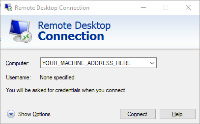

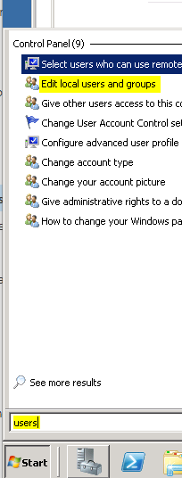

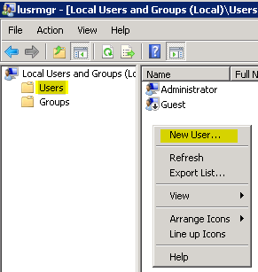

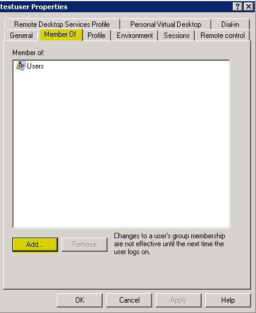

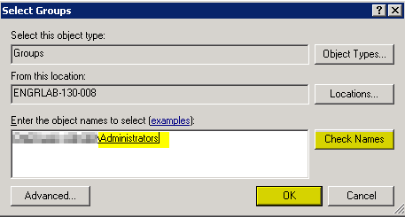

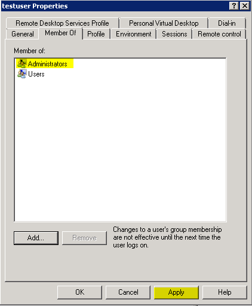

## Set the DNS server (to self)

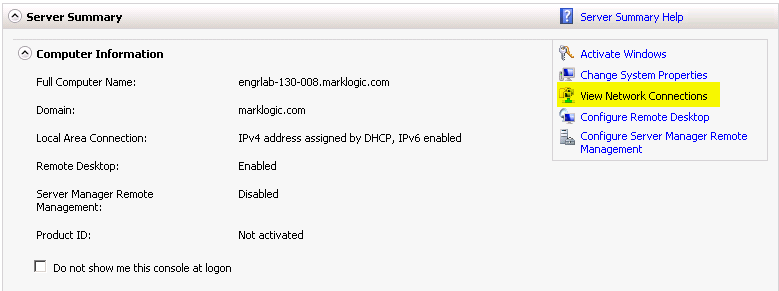

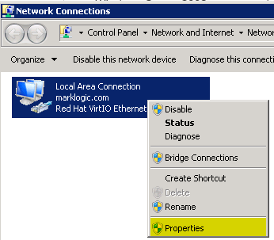

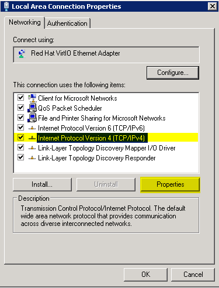

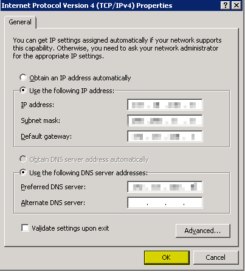

See: https://support.rackspace.com/how-to/installing-active-directory-domain-services-on-windows-server-2008-r2-enterprise-64-bit/

Windows Server 2008 can properly install and configure DNS during the AD DS installation if it knows that the DNS is local. To accomplish this, assign the private network adapter to the preferred DNS server address of the same private network adapter, as follows:

    From the Windows Start menu, open Administrative Tools > Server Manager.

    In the Server Summary section of the Server Manager window, click View Network Connections.

    In the Network Connections window, right-click the private adapter and select Properties.

    From the list of conected items, select Internet Protocol Version 4, and then click Properties.

    Copy the IP address that is displayed in the IP address box and paste it in the Preferred DNS server box. Then, click OK.

## Add the Active Directory Domain Services role
   

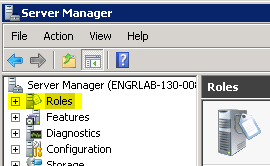

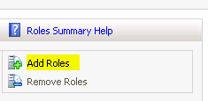

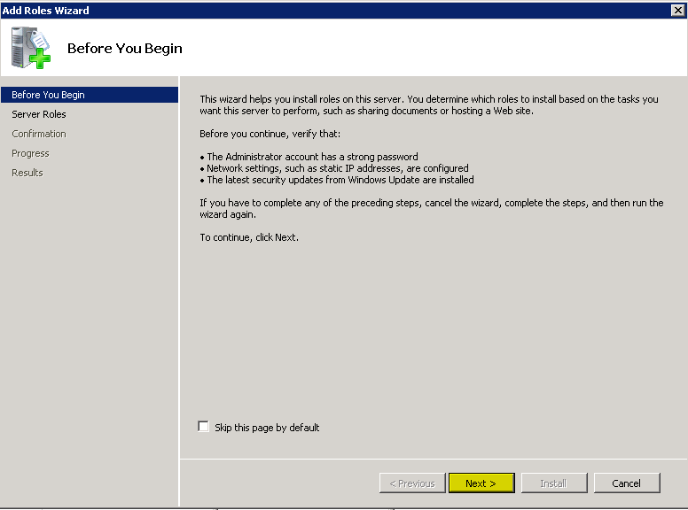

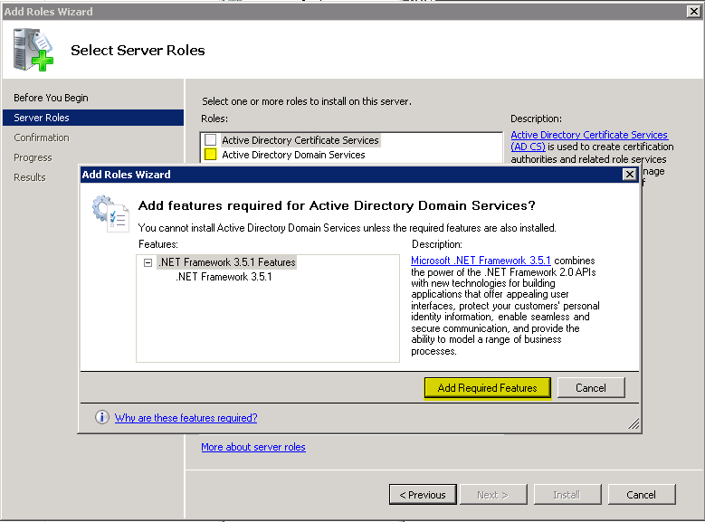

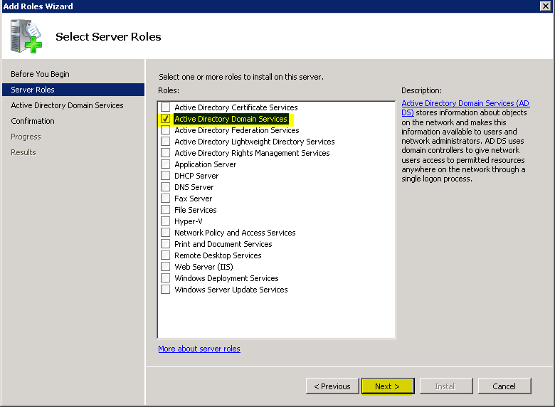

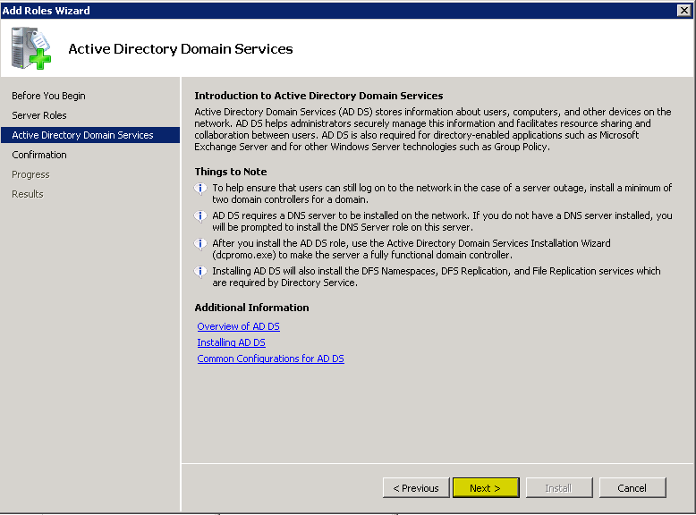

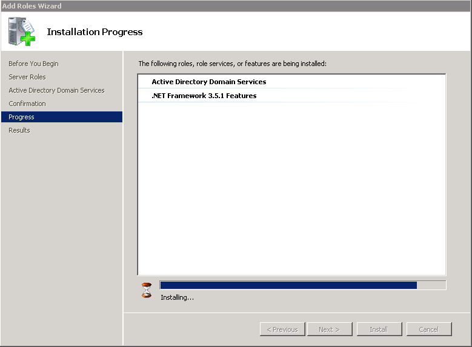

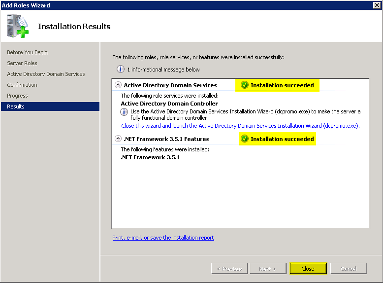
   
Adding the Active Directory Domain Services role installs the framework for Windows Server 2008 to become a DC and run AD DS. It does not promote the server to a DC or install AD DS.
   
       In the Server Manager window, select the Roles directory.
   
       In the Roles Summary section, click Add Roles.
   
       On the Before You Begin page of the Add Roles Wizard, click Next.
   
       On the Select Server Roles page, select the Active Directory Domain Services check box, and then click Next.
   
       On the Confirmation page, click Next.
   
       On the Installation Progress page, click Install.
   
       On the Results page, after the role is successfully added, click Close.

## Install AD DS

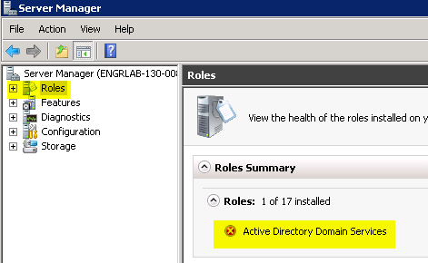

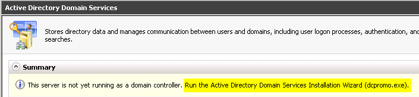

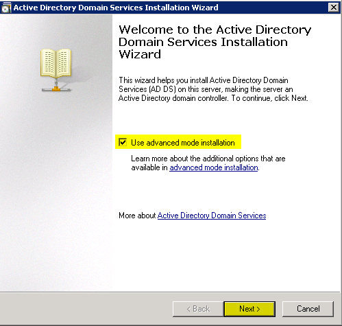

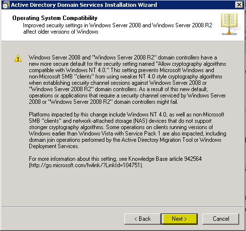

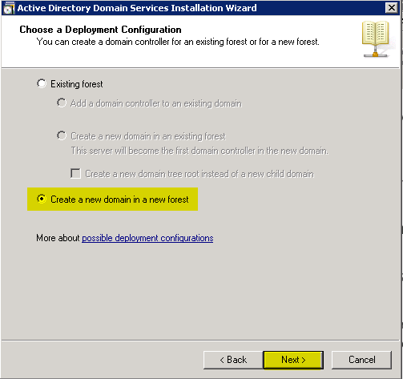

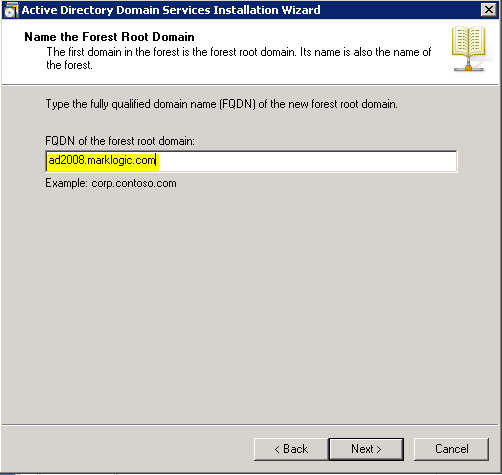

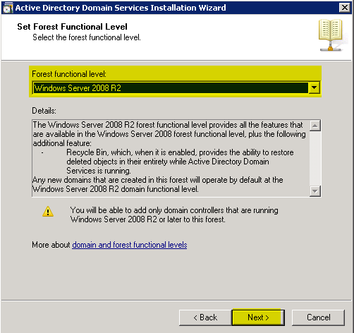

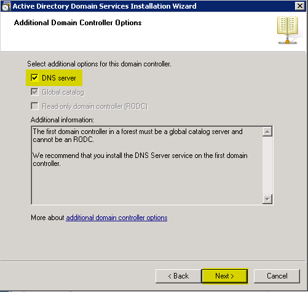

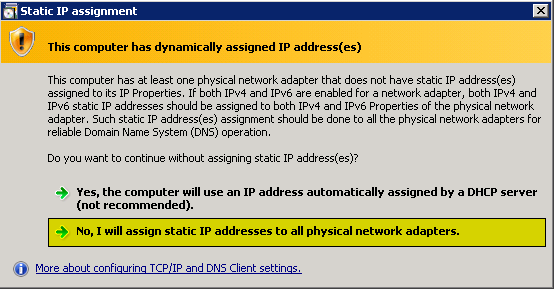

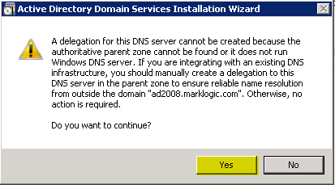

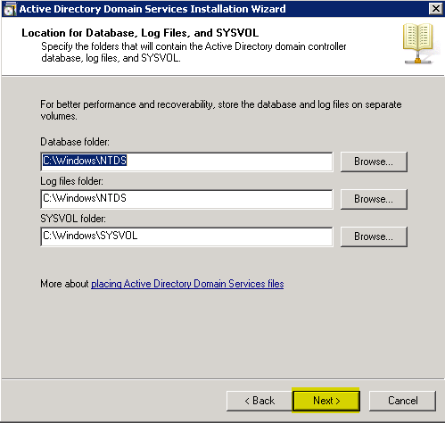

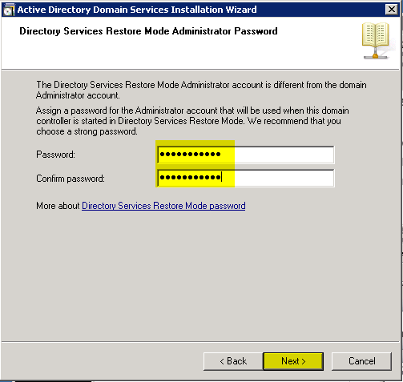

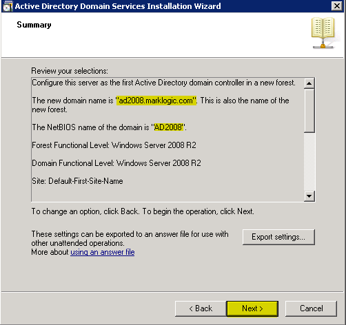

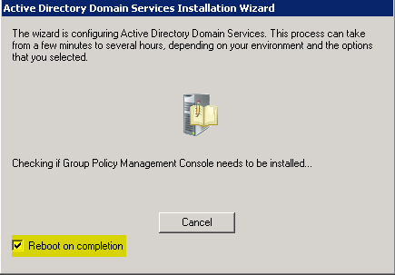

Now that you have prepared the server, you can install AD DS (DCPROMO).

Note: As an alternative to performing steps 1 through 3, you can type dcpromo.exe at the command prompt. Then, skip to step 4.

1.If it is not already open, open the Server Manager window.

2.Select Roles > Active Directory Domain Services.

3.In the Summary section,click Run the Active Directory Domain Services Installation Wizard (dcpromo.exe).

4.On the Welcome page of the Active Directory Domain Services Installation Wizard, ensure that the Use advanced mode installation check box is cleared, and then click Next.

5.On the Operating System Compatibility page, click Next.

6.On the Choose a Deployment Configuration page, select Create a new domain in a new forest and then click Next.

7.On the Name the Forest Root Domain page, enter the domain name that you choose during preparation steps. Then, click Next.

The installation program verifies the NetBIOS name.

8.On the Set Forest Functional Level page, select Windows Server 2008 R2 in the Forest function level list. Then, click Next.

The installation program examines and verifies your DNS setting.

9.On the Additional Domain Controller Options page, ensure that the DNS server check box is selected, and then click Next.

10.In the message dialog box that appears, click Yes.

11.On the Location for Database, Log Files, and SYSVOL page, accept the default values and then click Next.

12.On the Directory Services Restore Mode Administrator Password page, enter the domain administrator password that you chose during the preparation steps. This is not your admin password that was emailed to you during the creation of your server, although you can use that password if you want to. Then, click Next.

13.On the Summary page, review your selections and then click Next.

The installation begins.

Note: If you want the server to restart automatically after the installation is completed, select the Reboot on completion check box.

14.If you did not select the Reboot on completion check box, click Finish in the wizard. Then, restart the server.

15.After a few minutes, reconnect to your server in the Console in the Cloud Control Panel or RDP.

16.To log in, perform the following steps:

## Logging back in after rebooting

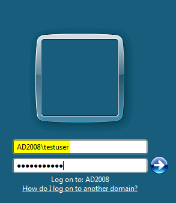